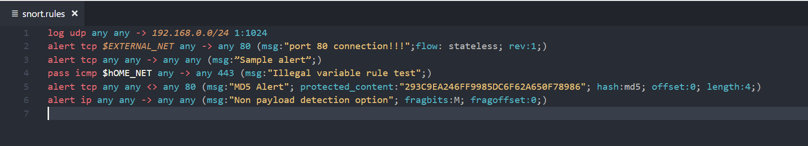

# Snort Rules Support for Visual Studio Code

Language colorizer for Snort NIDS/NIPS rules

#### Please Note:
##### I don't work for Cisco nor am I related to Cisco/Sourcefire/Snort in any official capacity

## Release Notes
See CHANGELOG

-----------------------------------------------------------------------------------------------------------

## Problems?
If you encounter an issue with the syntax, feel free to create an issue or pull request!

### Citations
* Other Snort-related extensions
    * [Snort3 Test Explorer](https://marketplace.visualstudio.com/items?itemName=diptopandit.snort3-test-adapter) - looks pretty cool, though I haven't tried it myself
* Researched Snort using and pulled rules from:
    * [Snort Overview](http://manual-snort-org.s3-website-us-east-1.amazonaws.com/)
    * [EZ Snort Rules](http://www.vorant.com/files/EZ_Snort_Rules.pdf)
    * [O'Reilly's Snort Cookbook](http://commons.oreilly.com/wiki/index.php/Snort_Cookbook/Rules_and_Signatures#How_to_Build_Rules)
* Got some help understanding wtf TextMate is from:
    * [Writing a TextMate Grammar: Some Lessons Learned](http://www.apeth.com/nonblog/stories/textmatebundle.html)
    * [TextMate Docs](http://manual.macromates.com/en/language_grammars)
    * [Sublime3 Scope Names](https://www.sublimetext.com/docs/3/scope_naming.html)
* IP address regular expressions pulled from:
    * [Regular expressions for IP addresses, CIDR ranges and hostnames](http://blog.markhatton.co.uk/2011/03/15/regular-expressions-for-ip-addresses-cidr-ranges-and-hostnames/)
